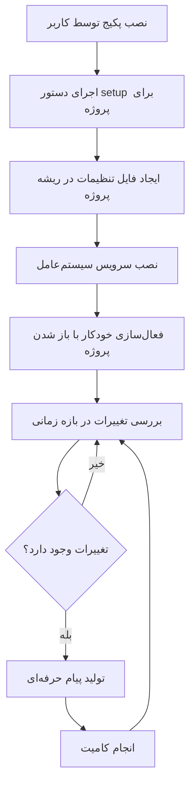
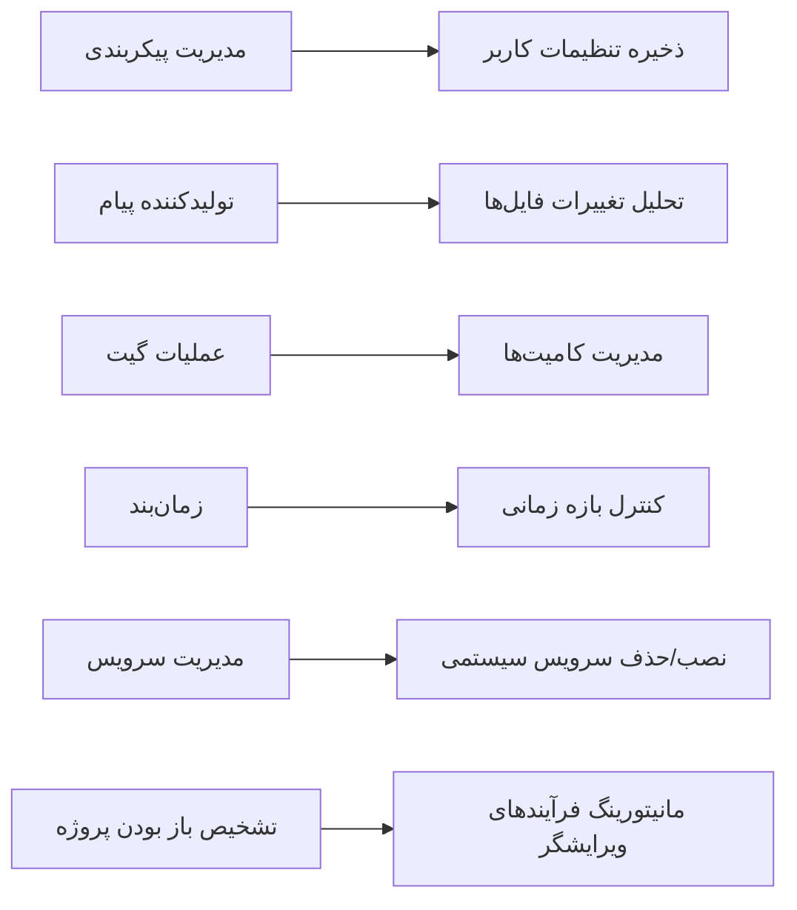
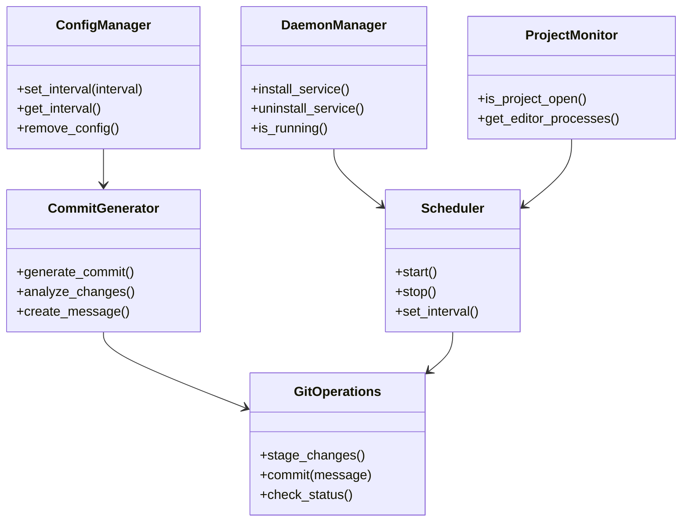
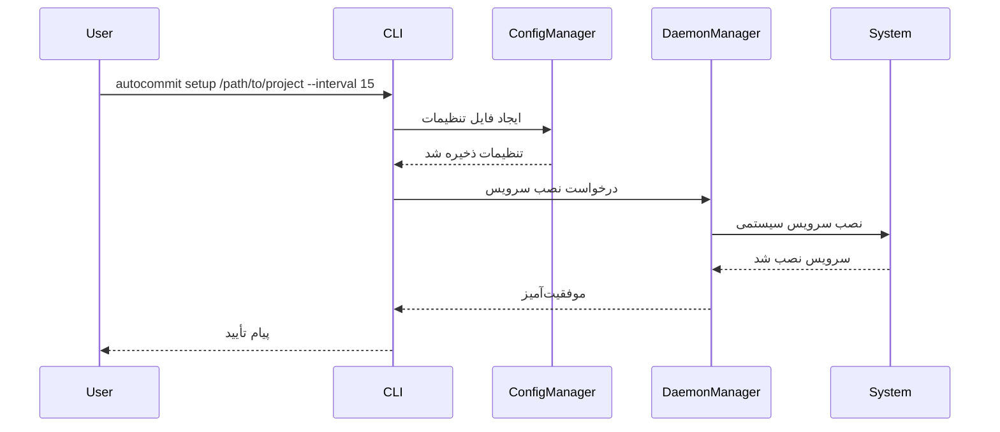
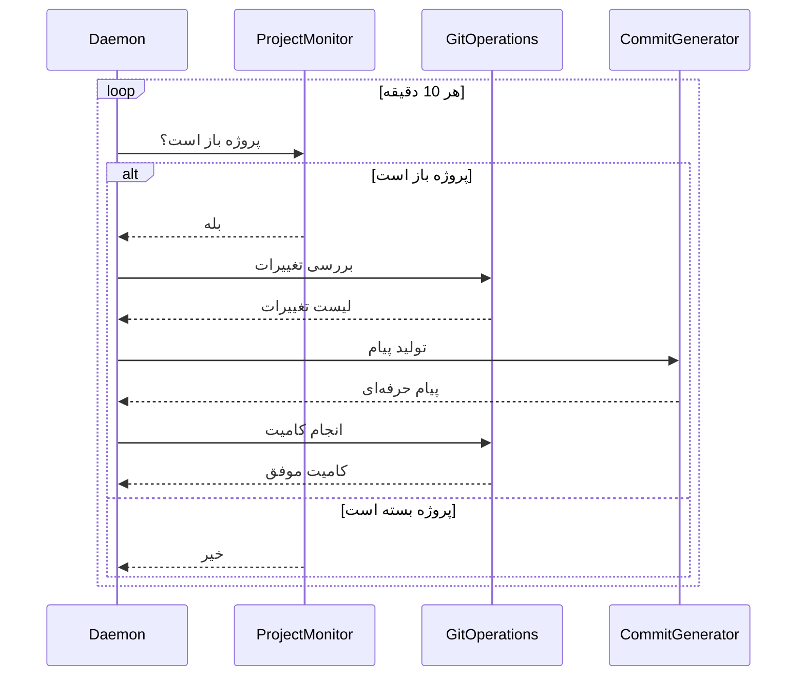
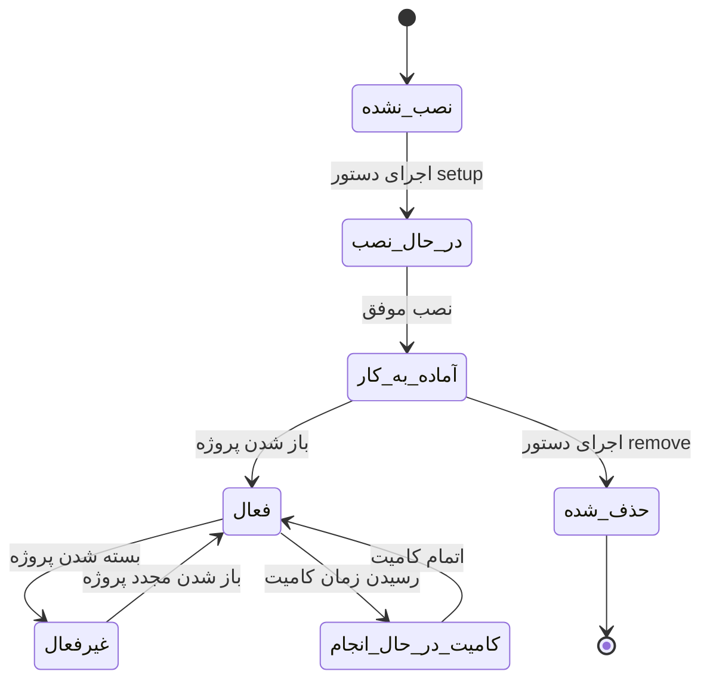
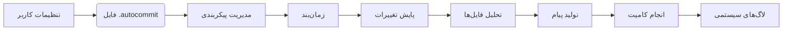
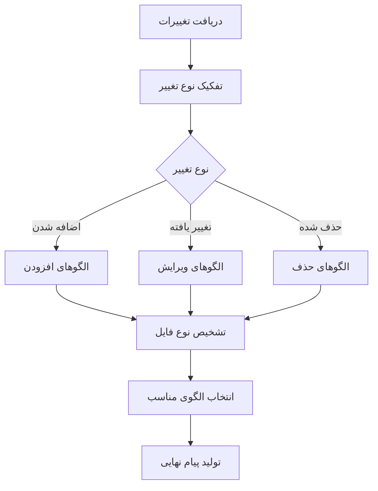
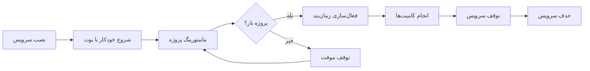
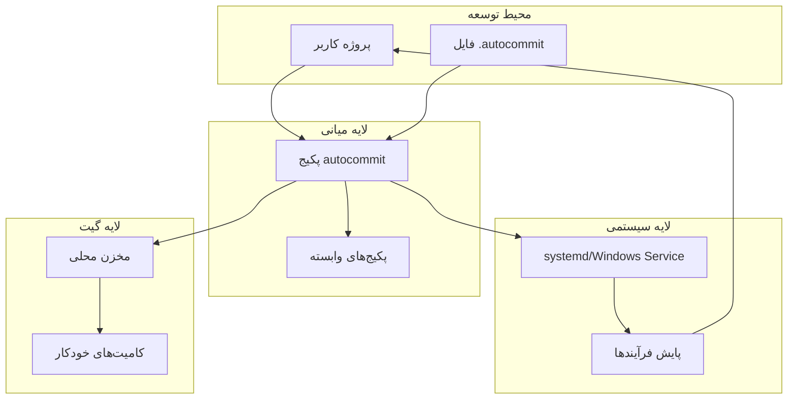

### طراحی پکیج خودکار کامیت در پایتون (بدون کد)

#### 1. مراحل کلی عملکرد پکیج


#### 2. کامپوننت‌های اصلی پکیج


#### 3. دیاگرام کلاس‌ها (UML)


#### 4. فرآیند نصب و راه‌اندازی


#### 5. فرآیند اجرای خودکار کامیت


#### 6. معماری پکیج
```mermaid
graph TB
    subgraph لایه کاربر
        A[دستورات CLI]
    end
    
    subgraph لایه منطق کسب‌وکار
        B[مدیریت پیکربندی]
        C[تولید پیام کامیت]
        D[عملیات گیت]
        E[زمان‌بندی]
    end
    
    subgraph لایه سرویس
        F[مدیریت سرویس لینوکس]
        G[مدیریت سرویس ویندوز]
    end
    
    subgraph لایه سیستمی
        H[systemd]
        I[Windows Service]
        J[پایش فرآیندها]
    end
    
    A --> B
    B --> C
    C --> D
    D --> E
    E --> F
    E --> G
    F --> H
    G --> I
    E --> J
```

#### 7. دیاگرام حالت‌های سیستم


#### 8. جریان داده‌ها


#### 9. ماتریس قابلیت‌ها بر اساس پلتفرم
| قابلیت                  | لینوکس                 | ویندوز               |
|-------------------------|------------------------|----------------------|
| نصب سرویس               | systemd                | Windows Service      |
| تشخیص باز بودن پروژه    | بررسی فرآیندها         | بررسی فرآیندها       |
| زمان‌بندی               | schedule + sleep       | schedule + sleep     |
| مدیریت پیکربندی         | فایل متنی در پروژه     | فایل متنی در پروژه   |
| لاگ‌ینگ                 | syslog                 | Event Log            |
| دسترسی به سیستم         | نیاز به sudo           | نیاز به دسترسی ادمین |

#### 10. فرآیند تولید پیام حرفه‌ای


#### 11. مدیریت چرخه حیات سرویس


#### 12. دیاگرام استقرار


